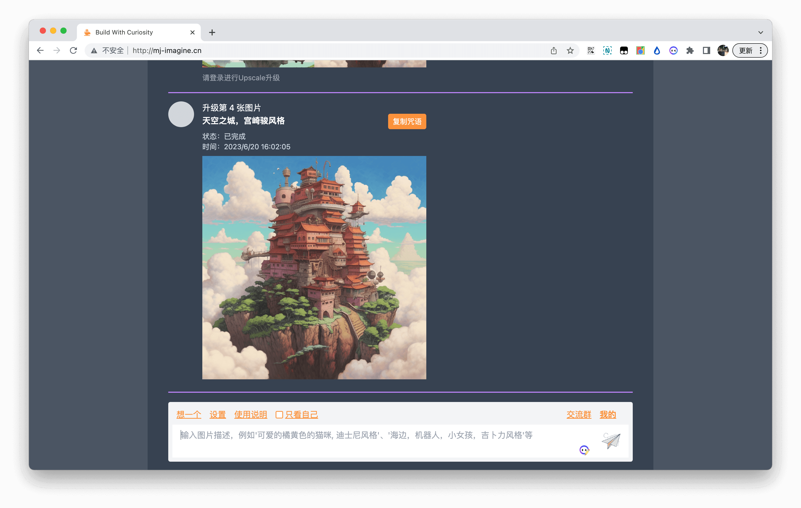
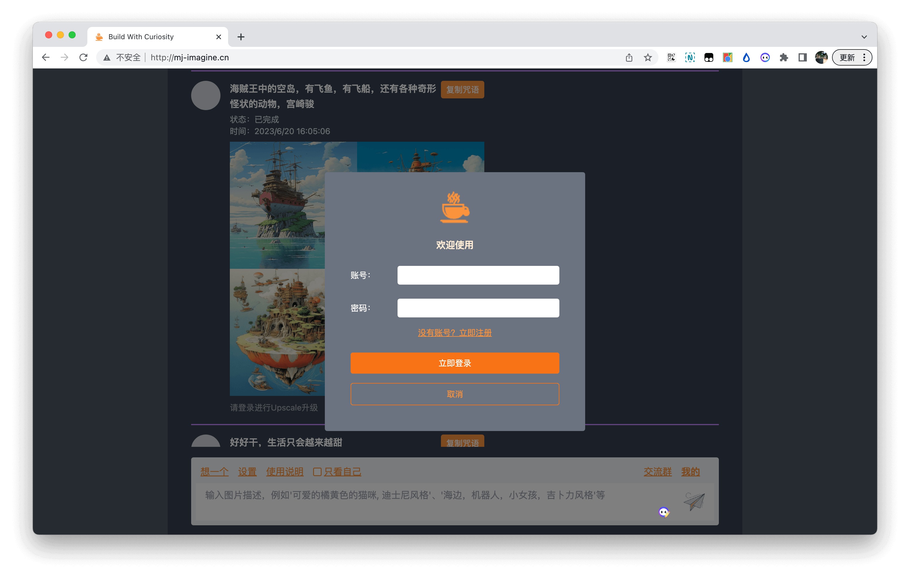
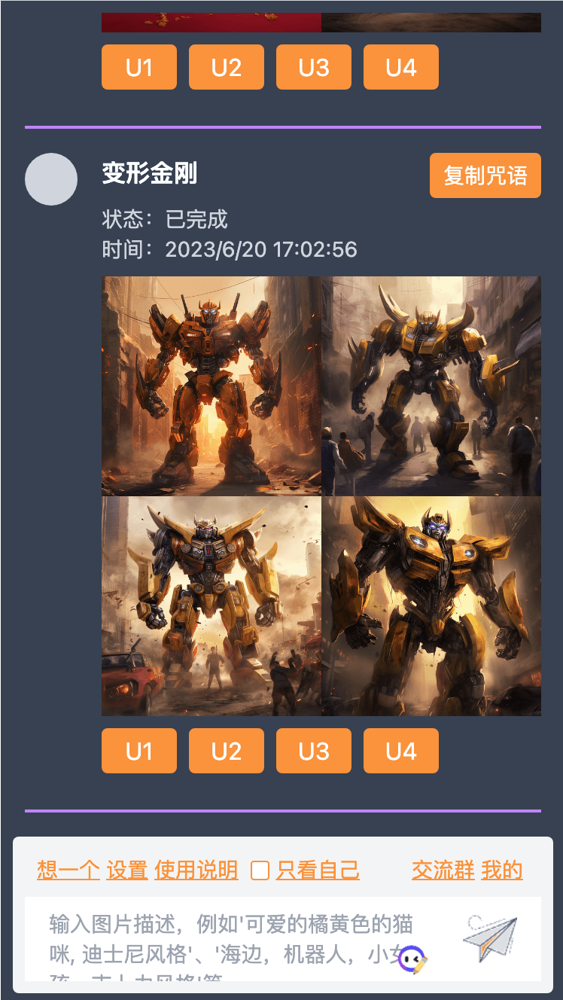

# Midjourney Client Web

基于[midjourney-client](https://github.com/erictik/midjourney-client)的api开发的可交互绘画界面，需要自行实现后端代理部分

## 在线体验/反馈
- [体验地址：http://mj-imagine.cn/](http://mj-imagine.cn/)
- [其他交流，反馈问题](#页面截图)

## 技术栈
- 渲染/构建框架：vue3 + vite + typescript
- ui库：element-plus
- 样式处理：tailwind
- 请求库：axios
- 其他：crypto-js、clipboard、socket.io

## 已完成功能
- [x] 列表展示
- [x] 只看我的
- [x] 登录注册
- [x] Imagine生成图片
- [x] Upscale升级图片
- [x] 设置绘画参数
- [x] websocket接收绘画进度
- [x] pc和移动端展示

## Todo/计划
- [] 支持用户设置显示头像 or 随机文本头像

## 页面截图
   

   

   

## 反馈/交流
   
